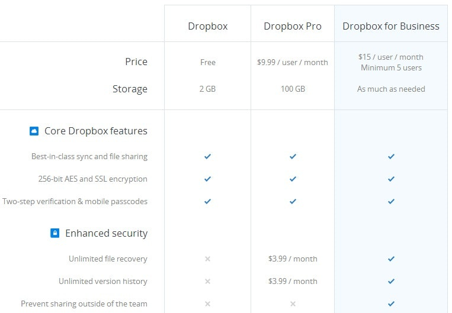

[Join the telegram group](https://t.me/joinchat/DwEd_xcORJOv6m7Li7yOow)

THIS is a living document!  See something you don't like? [File an issue!](https://github.com/FEMBusinessModelsRing/web3_revenue_primitives/issues/new)  Got something you want to see? [File an issue](https://github.com/FEMBusinessModelsRing/web3_revenue_primitives/issues/new)!

# Web 3 Revenue Primitives

*Core primitives* are a set of concepts that are innately understood but cannot be expressed in simpler terms.

This repository is an attempt at list of *web3 revenue primitives*, created by, for, and at [ETHMagicians Prague 2018 by the business models ring](https://hackmd.io/DaJhrasLQteUk3IwX5bQAg?view#8-Business-Models-Ring).

[Notes from Business Models Ring at Eth Magicians, the first session which convened on 2018/10/29, are here](https://hackmd.io/W11KX6Y9R3idXXhN2tHFzA).

More discussions about business models have been taken at ETH Denver 2019.

[Notes from Business Models Ring at Eth Magicians, at ETH Denver on 2019/2/14, are here](https://hackmd.io/N_nZMiA5S5Gtp18gYT14FA).

## TOC

- [Web 3 Revenue Primitives](#web-3-revenue-primitives)
  * [TOC](#toc)
  * [Revenue Share](#revenue-share)
    * [Percentage Fee](#percentage-fee)
    * [Income Share](#income-share)
    * [Government taxes](#government-taxes)
  * [ICOS](#icos)
  * [Continuous Funding Models](#continuous-funding-models)
  * [Streaming Money](#streaming-money)
    + [Side Channels:](#side-channels-)
    + [State Channels:](#state-channels-)
  * [Non Fungible Tokens](#non-fungible-tokens)
  * [Subscriptions](#subscriptions)
  * [Self-Sovereign Identity](#self-sovereign-identity)
  * [Lending](#lending)
  * [Curating](#curating)
  * [Creating](#creating)
  * [Funding](#funding)
    + [Budgeting](#budgeting)
      - [Limitations of existing Open Source Budget template:](#limitations-of-existing-open-source-budget-template-)
      - [Treasury management:](#treasury-management-)
      - [Additional thoughts:](#additional-thoughts-)
  * [Advertising](#advertising)
  * [Personal Tokens](#personal-tokens)
  * [Stablecoins Business Models](#stablecoins-business-models)
    + [Fiat-Backed](#fiat-backed)
    + [Crypto-Backed](#crypto-backed)
    + [Algorithmic](#algorithmic)
  * [Questionable / Possible Ponzi Schemes](#questionable---possible-ponzi-schemes)
    + [Rent](#rent)
- [Revenue Models](#revenue-models)
  * [8(+1) types of revenue models](#8--1--types-of-revenue-models)
  * [Why is this important?](#why-is-this-important-)
  * [Examples of disruptive business / revenue models](#examples-of-disruptive-business---revenue-models)
  * [New revenue models](#new-revenue-models)
- [Web2 Revenue Models](#web2-revenue-models)
  * [Examples](#examples)
      - [Advertising Model](#advertising-model)
      - [Commerce Model](#commerce-model)
      - [Subscription Model](#subscription-model)
      - [Freemium Model](#freemium-model)
      - [Peer to Peer Model](#peer-to-peer-model)
      - [Transaction Processing Model](#transaction-processing-model)
      - [Licensing Model](#licensing-model)
      - [Data Model](#data-model)
- [What did we miss?](#what-did-we-miss-)

## Revenue Share 

The Revenue share uses profits to enable separate actors to develop efficiencies or innovate in mutually beneficial ways such as spliting earnings. It has become a popular tool within corporate governance to promote partnerships, increase sales or share costs.

Some popular revenue share examples:

* [Percentage Fee](#percentage-fee)
* [Income Share](#income-share)
* [Government taxes](#government-taxes)

### Percentage Fee

This model is where you take a % of each trasanction done on your platform. It is popular with exchanges and marketplaces.

Usually who pays for the % is the seller, since he is the one that gets the benefit of getting a sale done thanks to the connectiong provided by the platform. An offline example would be a supermarket.

Notable examples:

  * [Open Sea](https://opensea.io/)
  * [Amazon](amazon.com)
  * [Airbnb](airbnb.com)

### Income Share

A pool of users share earnings from another entity. An offline example would be a restaurant where the cashier shares the tips with everyone. Web 3 takes this model to a new level, for example you could give 1 dollar tip in a coffee shop and split it with every actor in the coffee value chain with a minimal cost of transaction.

Some projects working with Tip Splitting:

* [Meridio](https://www.meridio.co/) Divisible real estate with equity and ownership.
* [Affogato Network](https://affogatonetwork.com/) Split tips to a barista and a coffee grower.

### Government taxes

A community shares earnings in order to improve everyones lifes. Corruption makes it a not working model.

## ICOS

Sell a bunch of ERC20 tokens at once, or during a window of time.

Some popular ICO models:

* [Security Token Offerings](https://blockgeeks.com/guides/security-tokens/)
* [Interactive ICO](https://medium.com/legal-block/interactive-coin-offering-a-token-distribution-alternative-model-or-the-new-face-of-the-ipos-61eee71e75ef)
* [Initial Supply Auction](https://medium.com/@MetronomeToken/metronomes-initial-supply-auction-quick-glance-price-chart-c9132595871e)
* [Simple Agreement for Future Tokens](https://medium.com/@argongroup/explaining-the-simple-agreement-for-future-tokens-framework-15d5e7543323)
* [Cryptocurrency Airdrop](https://en.wikipedia.org/wiki/Airdrop_(cryptocurrency))

Some popular ICOs:

* [Neo(China's Ethereum)](https://www.investinblockchain.com/what-is-neo/)
* [Stratis](https://www.investinblockchain.com/invest-in-stratis/)
* [Ark](https://www.investinblockchain.com/what-is-ark/)
* [Populous](https://www.investinblockchain.com/what-is-populous/)

Types of tokens:

* [Utility Token](https://medium.com/coinmonks/utility-tokens-a-general-understanding-f6a5f9699cc0)
* [Equity/Security Token](https://blockgeeks.com/guides/security-tokens/)
* [Currency Token](https://cryptocurrencyfacts.com/what-is-a-cryptocurrency-token/)
* [Reward Token](https://bitcoinexchangeguide.com/rewards-token-ico/)
* [Asset Token](https://medium.com/pecunio/the-rise-of-asset-backed-tokens-90570438261c)

## Continuous Funding Models

Continuous Funding Models are business models that sell ERC20 tokens *over time*, rather than all at once.

* [Curved Bonding](https://medium.com/@simondlr/tokens-2-0-curved-token-bonding-in-curation-markets-1764a2e0bee5)

  Curved Bonding is a method of continuous funding that incentivizes early investment. In contrast to conventional ERC20 token sales and ICO's, which feature each individual token being sold for the same price (no matter the time of purchase), such models hardcode buy price according to an algorithmic curve. In doing so, by purchasing early, investors get more tokens for the same price, than if they had purchased later. Thus, using Curved Bonding incentivizes early adopters to invest in a token.

* [Continuous Organizations](https://medium.com/@thibauld/introducing-continuous-organizations-22ad9d1f63b7?_branch_match_id=578515516036471346)

  A continuous organization is one that sets up a *Decentralized Autonomous Trust* (DAT): an immutable smart-contract that implements curve bonding to automatically mint, burn, and distribute security tokens called FAIR *securities*. Organizations provide value to the trust by channeling part or all of their cash flow to it:
  1. When an investor **buys** FAIR, new FAIR tokens are minted by the trust, thus, increasing the price of the existing FAIR tokens. Part of the money invested goes to the organization, and part is held by the trust in its *buy-back-reserve*.
  2. When an investor **sells** FAIR, the FAIR tokens sold are burned by the trust, which decreases the price of FAIR tokens. The trust refunds the investor with funds in its *buy-back-reserve*.
  3. When the trust receives a **payment**, a fraction of the payment is used to mint new FAIR tokens which: (1) increases the price of existing FAIR tokens, and (2) increases the trusts *buy-back-reserve*. The rest of the money goes to the organization.
  4. When the trust receives a **dividend** payment from the organization, the dividend is used to mint and issue new FAIR tokens to current FAIR token holders, thus, increasing both the price of the token and the *buy-back-reserve*.

  In a simpler manner, a *Decentralized Autonomous Trust* allows an organization to: 
  
  1. Continuously mint tokens whenever demand exceeds supply, thus, providing ongoing funding for the organization.
  2. Guarantee that an investor will always be able to buy or sell their FAIR tokens (albeit, not at the price they want) no matter if the token is listed publically or not, due to the *buy-back-reserve*.
  3. Promote long term investment through the continual minting and dispersion of FAIR tokens upon dividend payments.

  **Note:** Such a business model is regarded as a security token offering and, as such, must comply with the security laws of its jurisdiction.

  For additional information, refer to the [white paper](https://github.com/C-ORG/whitepaper/).

## Streaming Money

### Side Channels:
A sidechain is a separate blockchain that is attached to its parent blockchain(mainchain) using a two-way peg. You can move assets to the sidechain and then back to the parent chain.
Sidechains need their own miners. These miners can be incentivized through ‘merged mining’, whereby two separate cryptocurrencies, based on the same algorithm, are mined simultaneously.
Here is a list of some of the Sidechain Projects:

* [Plasma](http://plasma.io/)
* [Loom](https://loomx.io/)
* [POA](https://poa.network/)
* [Truebit](https://truebit.io/)

### State Channels:
State channels are basically two-way pathways opened between two users that want to communicate with each other in the form of transactions. Here, only the final outcome needs to be included in the form of one single transaction on main chain. Other transaction's are done on off chain. Few know projects around it are:

* [Raiden Network](https://raiden.network/)
* [Machinomy](https://machinomy.com/)
* [FunFair](https://funfair.io/)
* [Liquidity](https://liquidity.network/)
* [Trinity](https://trinity.tech/#/)
* [Celer](https://www.celer.network/)
* [Spankchain](https://spankchain.com/)
* [Connext](https://connext.network/)
* [Counterfactual](https://counterfactual.com/)

## Non Fungible Tokens

Non fungible tokens are tokens that are unique from one another

Famous NFT projects:

* [CryptoKitties](https://medium.com/@codetractio/a-look-into-cryptokitties-revenue-model-6466b705a998)
* [OpenSea NFT marketplace](http://opensea.io)

## Subscriptions

Subscriptions are a recurring exchange of value over time.

* [EIP 1337](https://github.com/ethereum/EIPs/pull/1337)
* [1337 Alliance](https://1337alliance.com)

## Self-Sovereign Identity

Identity Standards Proposals:
* [EIP 725](https://github.com/ethereum/EIPs/issues/725)
* [EIP 725 Alliance](https://erc725alliance.org/)
* [EIP 1056](https://github.com/ethereum/EIPs/issues/1056) and [ERC 780](https://github.com/ethereum/EIPs/issues/780)
* [Identity Foundation](https://identity.foundation/)
* [Decentralized Identifiers (DID)](https://w3c-ccg.github.io/did-spec/)

Projects in the Identity space:
* [uPort](https://uport.me)
* [Civic](https://www.civic.com/)
* [BloomID](https://bloom.co/identity/)
* [TENZ-ID](https://tenzorum.org/tenz_id/)
* [Ethereum Name Service](https://ens.domains)

## Lending

Smart contracts that control credit scores, loan issuance, and interest payments will run on top of protocols like Ethereum. These debt contracts will be hashed into existence and generate hashflow for the lenders. This is a flow of hashflow above the base layer protocol.

* [Dharma Protocol](https://dharma.io/)
* [LoanScan](https://loanscan.io/)

## Curating

The job of a search engine like Google is to collect and curate data from the Internet. This is one of the most valuable curation projects in the world. The key with curation markets is to get all of the incentives aligned so that you can trust the underlying data. The term used in the industry is the Token Curated Registry.
It’s not just about creating a list. It’s about creating a list you can trust by incentivising curators to do the research for you.

* [Ocean Protocol](https://oceanprotocol.com/)
* [Messari](https://messari.io/)

## Creating

The creation of new things on chains will have value. Selling them to people who want them will generate hashflow. Making these unique tokens takes a lot of effort. You have to get a community of people to agree to their value.

* [Cryptokitties](https://www.cryptokitties.co/)

## Funding

Funding is the same whether it is at the ecosystem level or at the level of a single entity wanting to support funding. Grants are the main source of funding for projects in the Ethereum Community. Grants give a short time horizon for projects and don’t take into consideration the setup costs. Once a project has been set up, maintenance requires longer-term funding than grants provided. In many cases for an individual or small team, a business model of services can be considered on a project to project basis to find long term support. Operational costs hit projects with real-world budget and cash flow problems, and decentralized projects excel when they gather together for support. 

There is no one entity in charge of Ethereum, so the community must look at different funding bodies and revenue streams. For decentralized projects, it is a good idea to have different funding for different aspects of the ecosystem, such as stack, research, or community.  Obtaining multiple entities to fund a project is part of the shared ecosystem of Ethereum. Multiple entities of funding stop the community from defunding project Y, and instead disperse funding to both project X and Y. To get funding and sustainability of a project, it is best to collaborate with others who want to support the infrastructure, rather than waste time on putting together grant systems.

* [Funding Taxonomy](https://ethereum-magicians.org/t/funding-taxonomy-issues-for-ethereum-ecosystem/2014)
* [Funding Opportunities](https://github.com/fredexed/crypto-funding-ops)
* [Web3 Grants](https://hackmd.io/z5zFMTjiRJqs-4Wm43bJtQ)

### Budgeting
Closely associated to funding, budgeting and appropriating long-term cashflow is essential for the success of Ethereum projects, teams, and individuals. With an increasing focus on long-term sustainability, it is essential to outline a fundamental budget to track funds and plan for the foreseeable future. The [Open Source Budget](https://docs.google.com/spreadsheets/d/1CqaIu4ZupDWU0IedRXQw2coJptUhhyyMTu7ep6nNmIU/edit#gid=989402327) template by Boris Mann simplifies this concept into a simple, single currency spreadsheet for tracking expenses, basic payroll, and funding sources, in order to provide an outlook into long-term financial stability.

#### Limitations of existing Open Source Budget template:
  
  Identified limitations of the Open Source Budget template should be taken into consideration by Ethereum projects, teams, or individuals. These include:
  
  * The template assumes zero cost for an office or hardware.
  * The template does not factor in annual taxation or tax subsidization.
  * The template provides the "break-even" for a project, ignoring the potential need of a margin, or, buffer.

#### Treasury management:

  With projects being built on Ethereum, treasury management is also essential. Highlighted in a [Twitter thread](https://twitter.com/DeanEigenmann/status/1064723747582619648), it is generally recommended by Boris to keep upwards of six months of expenses for a team as a buffer. In addition, teams and projects should clarify their policies on payroll and payable expenses, to prevent market instability and variance from affecting their budgets (in the case that their budget is primarily in Ethereum or other non-fiat currencies).

#### Additional thoughts:

  With grants being main sources of funding for projects in the Ethereum Community, understanding their impact to long-term security & sustainability is essential. While one-off bounties and small grants may fund for the short-term, projects should look into additional sources of funding to ensure that they: (1) do not have to devote time and value to search for additional short-term funding, and (2) have a sustainable source of funding for their foreseeable project runway.

## Advertising

There are some options for doing advertising-based business models for open source projects, listed below.

* [CodeFund](http://codefund.app)

## Personal Tokens
Personal tokens are fixed-supply and -cost ERC20 tokens that derive their value from the performance of a human being. They are commonly used to tokenize either individual service offerings or a fixed-price hourly service.

* [DAppBoi](https://dappboi.com/)

  DAppBoi is an example of a personal token which tokenizes an hour of digital work by designer Matthew Vernon. By initiating the ERC20 token with a fixed supply of 100 $BOI tokens, purchasable directly from Matthew for 0.65ETH each, this personal token allows an individual to effectively purchase, trade, and invest in Matthew's design skillset.

  The tokens are redeemed by sending them to Matthew, who in exchange for 1 $BOI token provides 1 hour of design work. By using a personal token, not only does Matthew create demand for his skillset through a fixed token supply, but he also ensures that he will receive a minimum of 0.65ETH for each hour he works, since he is the primary supplier of the token and hence, regulates its price. In addition, using a personal token ensures that even if the market price for $BOI falls, Matthew will have already been compensated at his pre-determined hourly rate for the tokens in circulation.

  In the case that Matthew denies service to an individual who redeems $BOI, although the market valuation for the token may fall, Matthew has already been paid in advance for the initial purchase, thus, fulfilling his hourly rate.

## Radical Markets

### Constrained Capital Liberal Radicalism

The funding for Liberal Radicalism is likely to come from philanthropists or some dedicated government appropriation rather than from unlimited tax revenue. Capital-constrained Liberal Radicalism (CLR) aims to answer how philanthropists can fund public goods or services optimally. Traditionally funding is likely to come from philanthropists or some dedicated government appropriation. Funding can optimally be distributed to project by making contributions proportional to the number of contributions already received by the community. This allows collective decision making by the community in funding and will benefit a public good or service based on the good it provides to the community.

### Property is Monopoly

Imagine a world in which all major private wealth is constantly for sale at a fair price and where most of the value of this property is paid out equally to all citizens as a social dividend. While some might believe that the wealthy would dominate such a market, the most private wealth would become shared by all. Every asset would become cheaper to own, at the same time making large scale projects to become far easier to develop. In a system called Common Ownership Self-Assessed Tax (COST), every citizen would self-assess the value of assets they possess, pay tax on these values, and be required to sell any additional assets at this price. The tax would eliminate the need for other taxes on capital and reduce income tax, at the same time providing benefits through social dividends or funding public infrastructure. COST would create a healthier relationship to property, and help the community seek to increase the value of commonwealth.

### Radical Democracy

Envision a world where political minorities could be protected at the ballot without having the rely on judges or compromises on sensitive issues. With the trading of influence, the minority could overwhelmingly vote out oppressive politicians while the majority will keep the candidates that represent the best direction for the country. With Quadratic Voting, every citizen receives an equal amount of credits used to vote in collective decisions. Any issue can be voted on individually with these credits. The cost of a vote must be quadratic in the number of votes acquired, bringing an incentive to vote in proportion to the importance of the issue. This would lead to social decisions producing the greatest good for the greatest number of people.

### Uniting the World's Workers

The Visas between Individuals Program (VIP) gives the ability to sponsor an immigrant to citizens, while also benefiting the citizen through the sharing of gains. The program is not much different from today's world, where instead of the H1-B program trading sponsorship for gains to corporations the gains would be given to the individuals sponsoring. The migration would benefit all citizens, giving an extra stipend for hosting the migrant works and removing migration as a divisive issue in most countries. VIP would reduce the inequalities across countries, and allow the migrants to send back their earnings to their impoverished families. VIP would begin to break down the boundaries of wealthy countries and help out the poorer countries.

### Dismembering the Octopus

There is a possibility that, just by changing the structure of corporate ownership and antitrust regulations, wages will grow, prices will fall, and decent-paying jobs will become more available. Although the standard of living has stagnated the past 40 years, the stock markets have soared and the gap between the wealthy and poor has grown. The fundamental problem is that the antitrust laws the keep competition high have been unenforced. A simple, yet radical solution would be to limit institutional investors from investing in more than one company in each industry. This would force the promotion of competition between multiple companies in an industry. Antitrust prohibitions would also be applied to mergers, prohibiting the lowering of worker's wages to increase prices. All the is needed is for government antitrust enforcers or harmed groups of citizens to band together to defend their cause.

### Data as Labor

Data could be honored as an individual's work and compensated, instead of gathered by tech companies today. This change would open more well-paying jobs, and convert our passive consumers of entertainment to producers of data. With Data as Labor (DaL), we can build a fairer, more equal society, and spur the development of technology and economic growth. Data suppliers are currently not properly rewarded for contributions and lack the incentive to produce high-quality data. This wasteful model results in the dominance of large tech companies, such as Google, being able to thrive off of free user data. Awareness amount users about their data value make a large difference and empower them to demand more fair compensation. 

## Stablecoins Business Models

The main component behind stablecoins capturing value in a market is seigniorage. This is profit made by issuing currency, which is generated from the difference of the face value of the currency and its production costs. The three major types of stablecoins are:

* Fiat-backed
* Crypto-backed
* Algorithmic

### Fiat-Backed

A fiat-backed stablecoin system will collateralize every stablecoin issued with fiat currency or some other non-crypto asset. The fiat currency is stored with some custodian, such as a bank or major institution. 

These stable coins can generate revenue from collecting fees on issuing/redeeming stablecoins, market-making, or short-term lending. The most popular fiat stablecoin systems today are:
* [Tether](https://tether.to/)
* [TrueUSD](https://www.trusttoken.com/trueusd/)

### Crypto-Backed

Crypto-backed systems provide decentralized ways to maintain claims on collateral. Reserves of collateral are kept in the form of crypto-assets (such as ETH) on smart contracts. All issued stablecoins are backed by these reserves of ‘volatility coin’ collateral.

Crypto-backed stablecoin systems focus more on the volatility coin put up as collateral to generate revenue. These systems can collect transaction fees created on-chain. Holders of the volatility coin are then paid proportionally.
In the case of Maker, they issue stablecoins as collateralized debt positions, which accumulate interest at an annual rate of 2.5%. The interest is again paid proportionally to those holding on the volatility coin. Other crypto-backed stablecoins have issued shares for collateral assets, which can be redeemed in exchange for stablecoins or another asset. Check out:
* [Maker](https://makerdao.com/en/)
* [Havven](https://www.synthetix.io/)

### Algorithmic

A newer business model, algorithmic stablecoins adjust supply to stabilize price without collateral requirements. These stablecoins may use a volatility coin to capitalize the system at first. This system is very lucrative due to the fact that all supply increases in the stablecoin are distributed to those holding on to the volatility coin.

These stablecoin systems can issue shares called seigniorage shares. When there is demand for more stablecoins, more are issued to offset demand and keep price level. If demand decreases and price of stablecoins fall, shares are put up for sale in exchange for stablecoins, which are then burnt from supply. Therefore, if the market cap of stable coins reaches a certain level, the value of all seigniorage shares will be at that same level.

Another revenue-generating tactic are variable interest rate deposits, where users can deposit stablecoins into smart contracts that pay out interest. When demand is low, interest rates are increased to incentivize depositing stablecoins, which lowers the circulating supply of stablecoins and price increases; and vice-versa.

## Questionable / Possible Ponzi Schemes

TODO - What else should live here?

* [Fomo3d](https://medium.com/@eetusro/i-note-this-is-fin-e-6646f4a1e55b)

### Rent

* [Determining a fair rent model of ENS](https://discuss.ens.domains/t/determining-a-fair-rent-model/603) = NOTE: At ENS, the purpose of the rent is to avoid squatters rather than making profit

# Revenue Models

This breaks down business revenue models into 8 types and provides examples of each. In addition, we reference Ben Wenmuller’s series of tweets with a potentially new business model for decentralized platforms - capital gains.

## 8(+1) types of revenue models

||Description|Examples|
|--- |--- |--- |
|Unit sales|Sell a product or service to customers|Daily necessities at local market|
|Advertising fees|Sell others opportunities to distribute their message on your space.|Billboards, banner ads, search engine ads|
|Franchise fees|Sell the right for others to invest and manage a version of your business.|Fast food restaurants, e-sports leagues|
|Utility fees|Sell goods and services on a metered basis.|Road tolls, electricity and water bills|
|Subscription fees|Charge a fixed price for access to services for a set period of time.|Video and music streaming, gym memberships|
|Transaction fees|Charge a fee for referring, enabling, or executing a transaction between parties.|Credit card merchant fees, online stock trades|
|Professional fees|Provide professional services on a time-and-materials contract.|Lawyers, accountants, real estate agents|
|License fees|Sell the rights to use intellectual property.|Physical toys based on movie characters|
|Capital gains*|Rises in asset value (i.e. tokens) will benefit both the decentralized platform and its users/hodlers|Decentralized startups|

[*As proposed by Ben Werdmuller’s tweets.](https://twitter.com/benwerd/status/1060209690808745985)

## Why is this important?
A company’s revenue model, very simply, is the way it makes money. New applications of revenue models against traditional revenue models can create disruptive new businesses.

## Examples of disruptive business / revenue models
Video Entertainment

Company A - retail stores, charge per rental (unit sales)

Company B - online “DVDs-by-mail”, monthly fee (subscription)

## New revenue models
How can decentralized platforms up-end the revenue models for businesses that seem to have their revenue model locked in?

For example, payments, which has been based on utility fees.

# Web2 Revenue Models

 The system designed by which a business monitizes its services
---
*"The ideal revenue model will be one that improves the user experience, or at least in no way harms it."*

| Model     |                                      Description                                      | Examples |
|:------------------------:|-------------------------------------------------------------------------------------|:----------:|
| Advertising            |       Service is free to use, marketers pay to reach your users via advertising       | [examples](#advertising-model) |
| Commerce               |             Sell something to your users, keep some or all of the proceeds            | [examples](#commerce-model) |
| Subscription           |     Charge your users monthly or annually for the opportunity to use your service     | [examples](#subscription-model) |
| Freemium          |     Sell a basic free product to as many customers as possible, but keep the premium features exclusively for paying customers     | [examples](#freemium-model) |
| Peer to Peer           |  Connect people together in a network, take a small piece of the activity that ensues | [examples](#peer-to-peer-model) |
| Transaction Processing |      Settle transactions, then take a small piece of the transaction for doing so     | [examples](#transaction-processing-model) |
| Licensing              |          Charge users once upfront for the opportunity to use your technology         | [examples](#licensing-model) |
| Data                   |                          Sell the data your service generates                         | [examples](#data-model) |
| Mobile                 | Not a revenue model but presents unique challenges and opportunities for monetization | [itunes app store](https://itunes.apple.com/us/genre/ios/id36?mt=8) |
| Gaming                 | Not a revenue model but presents unique challenges and opportunities for monetization | [steam](https://store.steampowered.com) |

These categories are not mutually exclusive. Many web/mobile services use multiple revenue models. Freemium for example is a combination of advertising & subscription.
---
## Examples

#### Advertising Model
* Search Ads - [Google](https://google.com)
* Video Ads - [Youtube](https://youtube.com)
* Location-based Ads - [Foursquare](https://foursquare.com)

#### Commerce Model
* Group buying - [Groupon](https://groupon.com)
* Digital goods/downloads - [Itunes](https://itunes.com)
* Auction commerce - [Ebay](https://ebay.com)

#### Subscription Model
* Software as a Service (SaaS) - [FreshDesk](https://freshdesk.com)
* Infrastructure as a Service (IaaS) - [AWS](https://aws.amazon.com/)
* Membership services - [Amazon Prime](https://www.amazon.com/gp/prime
)

#### Freemium Model
* [Dropbox](https://dropbox.com)

* [Adobe](https://adobe.com)
* [LinkedIn](https://linkedin.com)

#### Peer to Peer Model
* [Airbnb](https://airbnb.com)
* [Uber](https://uber.com)
* [Match.com](https://match.com)

#### Transaction Processing Model
* [Paypal](https://paypal.com)
* [Stripe](https://stripe.com)
* [Google Pay](https://pay.google.com/)

#### Licensing Model
* Per Device/Server License – [Microsoft products](https://microsoft.com)
* Per Application instance – [Adobe Photoshop](https://adobe.com)
* Patent Licensing – [Qualcomm](https://qualcomm.com)

#### Data Model
* User data - [LinkedIn](https://linkedin.com)
* Search data - [Google](https://google.com)
* Benchmarking services – [Comscore](https://comscore.com)

# Open-source business models
Open-source business models enable projects and organizations to collaboratively build software made freely available for redistribution or modification, while still being profitable ventures.

A few examples of tried and true open-source business models, summarized from Eric S. Raymond's [Magic Cauldron](https://blog.licensezero.com/2018/10/17/mapping-models.html) include:

* *Loss-Leader/Market Positioner*, example Mozilla, from Netscape developed to prevent Microsoft from dominating the web browser market.
* *Widget Frosting*, example Darwin, developed open-source to promote driver-support and reduce interface-tool development cost.
* *Give Away the Recipe, Open A Restaurant*, examples Cygnus and RedHat, which offer professional services and support for their open-source offerings.
* *Free the Software, Sell the Brand*, example Star Office, now OpenOffice.org. Many frequent contributors and platform developers run their own LibreOffice certification businesses to fund platform development.
* *Free the Software, Sell the Content*, for any intangible media businesses.
* *Free the Future, Sell the Present*, example Ghostscript, with older-versions being offered open-source, and newer-version sales driving business revenues.

## Free the Future, Sell the Present
Of the functioning business models above, one of the models is unlike the others: *Free the Future, Sell the Present*. Focused around being a value-added selling proposition, such business models focus on the value of the software being sold. As [License Zero](https://blog.licensezero.com/2018/10/17/mapping-models.html) put it best:

> The value they sell is the value of the software, and the software is open.

In a simple way, this license builds upon two concepts: *Dual Licensing* and *Delayed Release*:

1. Dual Licensing is the concept where individuals are open to develop on older source, but, they can pay to easily ship the latest-and-greatest version, without making the rest of their systems open to competitors.
2. Delayed Release is the concept that allows closed-software to be released as open source on a schedule. Before the release date, the license gives permission for non-production use only. On the scheduled release date, the license’s terms automatically transform into those of a standard open source license.

## What do users need to benefit from software?
Another aspect to consider when choosing a business model is to consider the needs of the user. A generalization is:

* *Implementation*: Users can't run software that doesn't exist.
* *Distribution*: Users can't run software someone else wrote, but didn't share.
* *Permission*: Users can't safely run software without a license.

From a users point of view, developers can choose to meet these requirements partially or completely:

> They can implement what one customer needs or wants, but not what another does. They can distribute copies to some users, but not to others. They can grant permission for the software to everyone, or only to specific customers.

## Constraints
Finally, when choosing an effective model, it's necessary to look forward to the future and consider constraints. Norms of open-source software limit developer freedom and choice, and understanding the limitations associated with open-source development is essential. For example, from a legal perspective, it's difficult to reduce the permissions of published open-source material, but, it is relatively straightforward to do the same for unpublished or proprietary content.

#### *Additional information*
For more information, [License Zero](https://blog.licensezero.com/2018/10/17/mapping-models.html)'s blog on mapping models should be referenced.

# What did we miss?  

Coming to Prague this October? [Join us on the business model ring at ETHMagicians 2018](https://hackmd.io/DaJhrasLQteUk3IwX5bQAg?view#8-Business-Models-Ring)

Remote? [Open an issue and let us know](https://github.com/owocki/web3_revenue_primitives/issues/new), or, even better, [open up a PR](https://github.com/owocki/web3_revenue_primitives/compare).

<!-- Google Analytics -->

